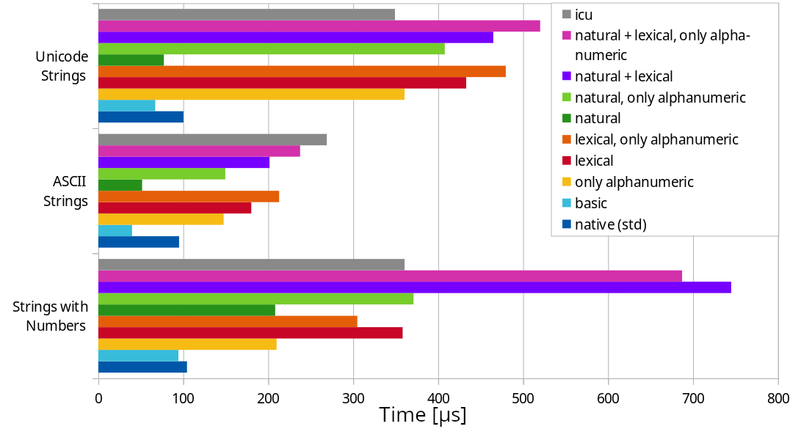

# lexical-sort

This is a library to compare and sort strings (or file paths) **lexicographically**. This means that non-ASCII characters such as `á` or `ß` are treated like their closest ASCII character: `á` is treated as `a`, `ß` is treated as `ss`, etc.

Lexical comparisons are case-insensitive. Alphanumeric characters are sorted after all other characters (punctuation, whitespace, special characters, emojis, ...).

It is possible to enable **natural sorting**, which also handles ASCII numbers. For example, `50` is less than `100` with natural sorting turned on. It's also possible to skip characters that aren't alphanumeric, so e.g. `f-5` is next to `f5`.

If different strings have the same ASCII representation (e.g. `"Foo"` and `"fóò"`), it falls back to the default method from the standard library, so sorting is deterministic.

<table><tr><td>
<b>NOTE</b>: This crate doesn't attempt to be correct for every locale, but it should work reasonably well for a wide range of locales, while providing excellent performance.
</td></tr></table>

## Usage

To sort strings or paths, you can use the `StringSort` or `StringSort` trait:

```rust
use lexical_sort::{StringSort, natural_lexical_cmp};

let mut strings = vec!["ß", "é", "100", "hello", "world", "50", ".", "B!"];
strings.string_sort_unstable(natural_lexical_cmp);

assert_eq!(&strings, &[".", "50", "100", "B!", "é", "hello", "ß", "world"]);
```

There are eight comparison functions:

| Function                         | lexico­graphical | natural | skips non-alphanumeric chars |
| -------------------------------- |:---------------:|:-------:|:----------------------------:|
| `cmp`                            |                 |         |                              |
| `only_alnum_cmp`                 |                 |         | yes                          |
| `lexical_cmp`                    | yes             |         |                              |
| `lexical_only_alnum_cmp`         | yes             |         | yes                          |
| `natural_cmp`                    |                 | yes     |                              |
| `natural_only_alnum_cmp`         |                 | yes     | yes                          |
| `natural_lexical_cmp`            | yes             | yes     |                              |
| `natural_lexical_­only_alnum_cmp` | yes             | yes     | yes                          |

Note that only the functions that sort lexicographically are case insensitive.

## Characteristics

All comparison functions constitute a [total order](https://en.wikipedia.org/wiki/Total_order). Two strings are only considered equal if they consist of exactly the same Unicode code points.

## Performance

The algorithm uses iterators and never allocates memory on the heap. It is optimized for strings that consist mostly of ASCII characters; for ASCII-only strings, the lexicographical comparison functions are only 2 to 3 times as slow as the default method from std, which just compares
Unicode code points.

Note that comparisons are slower for strings where many characters at the start are the same (after transliterating them to lowercase ASCII).

### Benchmarks

These benchmarks were executed on an AMD A8-7600 Radeon R7 CPU with 4x 3.1GHz.

- The first benchmark compares 100 randomly generated strings with 5 to 20 characters, containing both ASCII and non-ASCII characters.
- The second benchmark also compares 100 randomly generated strings with 5 to 20 characters, but they're ASCII-only.
- The last benchmark compares 100 randomly generated strings, each consisting of `"T-"` followed by 1 to 8 decimal digits. This is a stress test for natural sorting.

The last, dark blue bar is the string comparison function in the standard library:



## Contributing

Contributions, bug reports and feature requests are welcome!

If support for certain characters is missing, you can contribute them to the [any_ascii](https://github.com/hunterwb/any-ascii) crate.

Let me know if you want to use this in `no_std`. It's certainly possible to add `no_std` support to this crate and its dependencies.

## License

This project is dual-licensed under the **MIT** and **Apache 2.0** license.
Use whichever you prefer.
